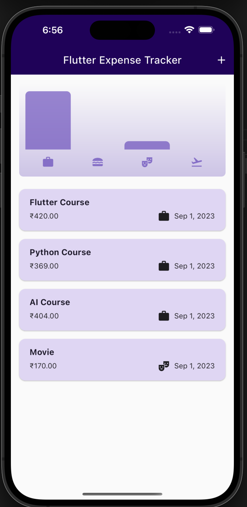
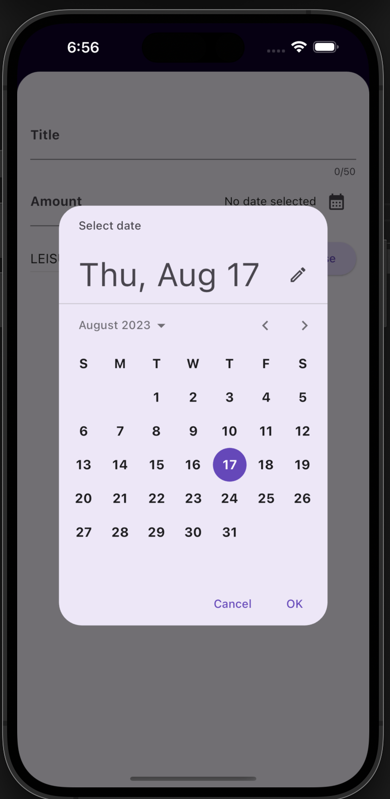
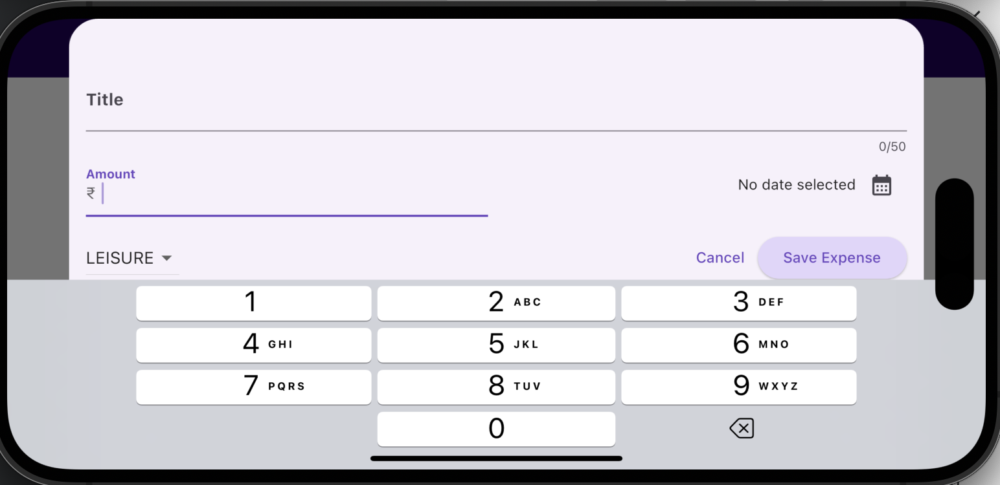
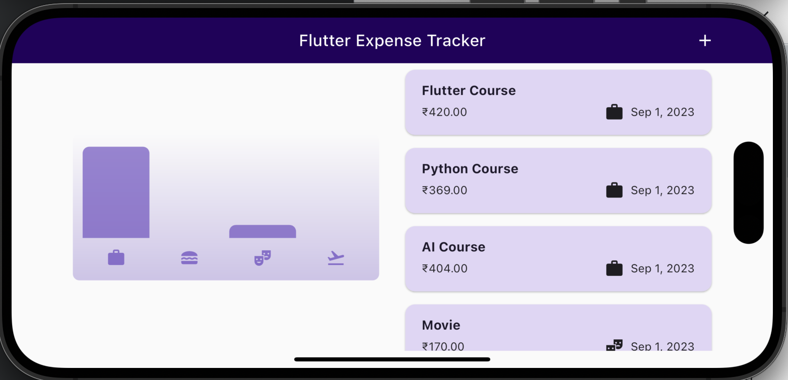

# Expense Tracker

Another basic flutter app to study user input handling, configuring and using themes/darkMode, modals, dialogs,etc. Responsive and adaptive concepts also touched upon

          

